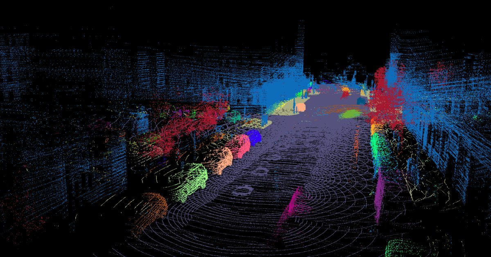

# 

# PCL Point Cloud Processing Pipeline

A configurable C++ library for point cloud processing built on top of the Point Cloud Library (PCL). This library is designed as a pipeline which can be used in autonomous driving and robotics applications, eliminating the need to implement common point cloud processing operations from scratch.

You just have to supply the point cloud input and set your desired parameters in the config file and the rest will be handled by the pipeline. It will output a processed point cloud in accordance with the parameters you have set. If you want to visualize the output, you can use the built in renderer as well.

## How to Use This Library

The recommended way to use this library is by adding it as a **Git submodule** to your own CMake project.

1.  **Add as a Submodule:**
    In your project's root directory, run:
    ```bash
    git submodule add <this_repo_url> external/pcl-processing-pipeline
    ```

2.  **Include in your `CMakeLists.txt`:**
    Add the following to your main `CMakeLists.txt` file:
    ```cmake
    # Add the submodule directory to your build
    add_subdirectory(external/pcl-processing-pipeline)

    # ... define your own executable ...
    add_executable(your_app src/your_app.cpp)

    # Link your application to the library
    # This automatically handles all include paths and PCL dependencies.
    target_link_libraries(your_app PRIVATE pcl_processor_lib)
    ```

3.  **Use in your Code:**
    You can now include the processor header and use the class.
    ```cpp
    #include "processor.h" // This path should be available now

    int main() {
        Processor<pcl::PointXYZI> processor("path/to/your/config.txt");
        auto cloud = processor.loadPcd("data.pcd");

        // Process the cloud without visualization
        auto processed_cloud = processor.processCloud(nullptr, cloud);

        // ... do something with processed_cloud ...

        return 0;
    }
    ```

## Building the Example

This repository includes an example executable to demonstrate its usefulness.

### Prerequisites
- PCL 1.12+
- C++17 compiler
- CMake 3.12+

### Build Steps
```bash
git clone <this_repo_url>
cd pcl-processing-pipeline

mkdir build && cd build
cmake ..
make -j$(nproc)

./pcl_processor_example ../test_data
```

## Features

### Processing Capabilities
- **Templated Design**: Works with any PCL point type (`pcl::PointXYZ`, `pcl::PointXYZI`, `pcl::PointXYZRGB`, etc.)
- **Voxel Grid Filtering**: Configurable downsampling for performance optimization
- **Region of Interest Cropping**: Spatial filtering to focus on relevant areas
- **Ego Vehicle Removal**: Remove points from the sensor's own vehicle/robot
- **Ground Plane Segmentation**: RANSAC based plane detection and separation
- **Euclidean Clustering**: KD tree based object clustering with configurable parameters
- **Bounding Box Generation**: Both axis aligned (AABB) and oriented (OBB) bounding boxes

### Visualization & I/O
- **Built in 3D Visualization**: Real time point cloud rendering with multiple camera angles
- **Configurable Colors**: Customizable colors for different point cloud components
- **Multiple Rendering Options**: Toggle between segmentation, clusters, and bounding boxes
- **PCD File Support**: Load, process, and save point cloud data
- **Streaming Mode**: Process sequences of PCD files with automatic iteration

### Configuration System
- **External Configuration**: All parameters configurable via text file `config.txt`
- **Test at runtime**: Change parameters without recompilation

## Configuration Parameters

| Parameter              | Type       | Description                        |
| ---------------------- | ---------- | ---------------------------------- |
| `filterResolution`     | `float`    | Voxel grid leaf size (meters)      |
| `minPoint`             | `Vector4f` | ROI minimum bounds (x,y,z,1)       |
| `maxPoint`             | `Vector4f` | ROI maximum bounds (x,y,z,1)       |
| `enableCropBox`        | `bool`     | Enable spatial cropping            |
| `enableRegionRemoval`  | `bool`     | Enable ego vehicle removal         |
| `removeMinPoint`       | `Vector4f` | Ego region min bounds              |
| `removeMaxPoint`       | `Vector4f` | Ego region max bounds              |
| `maxIterations`        | `int`      | RANSAC max iterations              |
| `distanceThreshold`    | `float`    | RANSAC distance threshold          |
| `clusterTolerance`     | `float`    | Euclidean clustering tolerance     |
| `minClusterSize`       | `int`      | Minimum cluster size               |
| `maxClusterSize`       | `int`      | Maximum cluster size               |
| `obstacleCloudColor`   | `Vector3f` | Obstacle point color (R,G,B)       |
| `groundPlaneColor`     | `Vector3f` | Ground plane color (R,G,B)         |
| `visualizerTurnedON`   | `bool`     | Enable visualization               |
| `CameraAngle`          | `int`      | Camera view (0-3)                  |
| `renderSegementation`  | `bool`     | Show segmented clouds              |
| `renderAxisAlignedBoxes` | `bool`     | Show AABB boxes                    |
| `renderOrientedBoxes`  | `bool`     | Show OBB boxes                     |
| `renderClusters`       | `bool`     | Show clustered objects             |

## Future Improvements

### Planned Features
- [ ] **Object Detection**: Integration with deep learning models
- [ ] **Multi sensor Fusion**: Camera + LiDAR processing
- [ ] **ROS2 Wrapper**: Native ROS2 package
- [ ] **Performance Profiling**: Timing analysis and optimization
- [ ] **Pipeline Statistics**: Processing metrics and reporting
- [ ] **Advanced Filtering**: Statistical outlier removal, bilateral filtering
- [ ] **Tracking**: Multi frame object tracking
- [ ] **Export Formats**: Support for PLY, OBJ, and other formats

### Performance Optimizations
- [ ] **GPU Acceleration**: CUDA based processing
- [ ] **Multi threading**: Parallel processing stages
- [ ] **Memory Optimization**: Reduced memory footprint

### Usability Improvements
- [ ] **Python Bindings**: Python API for rapid prototyping
- [ ] **GUI Configuration**: Visual parameter tuning
- [ ] **Plugin System**: Extensible processing modules
- [ ] **Docker Support**: Containerized deployment

### Other Useful Point Cloud Processing tools
- [Point Cloud Merger](https://github.com/RobinSchmid7/pointcloud_merger): This tool allows for cropping, voxelization, and merging of multiple point clouds based on timestamps. It operates in real time on a single CPU.

## Contributing

I welcome contributions!

## Acknowledgments

- Built as a wrapper around [Point Cloud Library (PCL)](https://pointclouds.org/)